# CORAZON DE PATATA
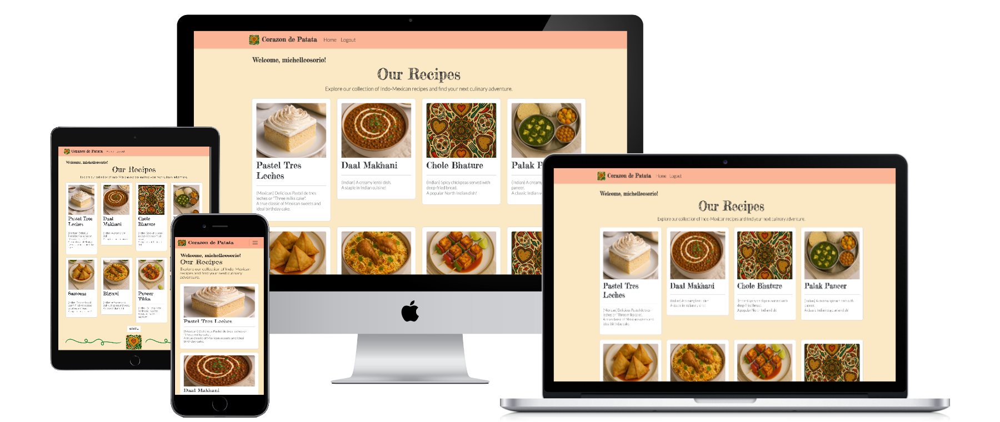

 

The deployed site can be found here: [Corazon de Patata](https://corazon-de-patata-be3857387485.herokuapp.com/)

<strong>Click here to view full screenshots of the website on the README folder.

[Full Screenshots](README-folder/full-screenshots)  </strong>


---

## Table of Contents

- [Introduction](#introduction)
- [UXD](#uxd)
  - [User Stories](#user-stories)
  - [Features](#features)
  - [Design](#design)
- [Database Schema](#database-schema)
- [Fixtures](#fixtures)
- [Views](#views)
- [Wireframes](#wireframes)
- [Technologies Used](#technologies-used)
- [Testing](#testing)
  - [Validation](#validation)
  - [Manual Testing](#manual-testing)
  - [Fixed Bugs](#fixed-bugs)
- [Deployment](#deployment)
- [Running the Project Locally](#running-the-project-locally)
- [Credits](#credits)
  - [Code](#code)
  - [Media](#media)
  - [Acknowledgements](#acknowledgements)

---

## Introduction

**CORAZON DE PATATA** is a Django-powered food blog inspired by Indo-Mexican fusion cuisine. It allows users to discover, rate, and comment on recipes. The site includes full backend functionality with admin controls, user authentication, and AJAX-powered interactions. 
The project was developed following the tutorial for the full-featured blog project "Codestar blog" by Code Institute.

---

## UXD

### Development Timeline

| Week commencing: | Task 1                                                         | Task 2                                                    | Task 3                     | Task 4                                                                  |
| ---------------- | -------------------------------------------------------------- | --------------------------------------------------------- | -------------------------- | ----------------------------------------------------------------------- |
| April 28, 2025   | Draft strategy, scope, structure, skeleton and surface planes. | Make initial wireframes and mockups.                      | User Stories               | Explore imagery and color palette to be used in site.                   |
| May 5, 2025      | Initial commit.                                                | Set up Django project and recipes app. Create database    | Site deployment on Heroku. | Set up templates. Basic HTML layout, general CSS and Bootstrap styling. |
| May 12, 2025     | Add star rating feature                                        | Add authentication and comments section with Crispy forms | Debug code.                | Enable serving of image files with Cloudinary.                          |
| May 19, 2025     | Tidy up code and debug                                         | Add custom error pages  

### User Stories
The user stories were managed via GitHub's Projects and Issues using a [Kanban board](https://github.com/users/osoriomica/projects/8) for ease of tracking open issues. 
1. As a site user I can view a paginated list of the published recipes so that I can browse and select a recipe to read
    - AC1 All published recipes are listed on the homepage.
    - AC2 - The list of recipes is spread over multiple pages
2. As a Site User I can **open a recipe ** so that I can read the full list of ingredients and cooking method
    - AC1 When a recipe card is clicked, the detailed recipe is opened on a new page.
3. As a site User / Admin I can view comments on individual recipes so that I can read the conversation and recipes' feedback: 
    - AC1 Admin can view any comments left by the users.  
    - AC2 Site users can read the published comments left on a recipe.  
4. As a Site User I can **register an account ** so that I can comment on a post
    - AC1 User can register an account with an email address.
    - AC2 User is able to log in.
    - AC3 Logged in users are able to comment.
5. As a logged-in Site User I can leave comments so that I can provide feedback or ask questions about a recipe
    - AC1 Comments are to be approved by Admin
    - AC2 User is able to reply to comments
6. As a Site User I can delete or modify my own comments so that I can be part of the conversation
    - AC1 Logged-in users, can modify their comments
    - AC2 Logged-in users, can delete their comments
7. As a Site Admin I have **CRUD abilities ** so that I can manage the site's content. As a logged-in site admin:
    - AC1 I can create and publish a recipe
    - AC2 I can read recipes
    - AC3 I can update recipes
    - AC4 I can delete recipes
8. As a logged-in Site Admin I can create draft recipes so that I can continue writing, editing the recipe at another time
    - AC1 I can save a draft of a recipe.
    - AC2 I can finish writing, editing the recipe later.
9. As a logged-in Site Admin I can approve or reject comments before they are visible to other users so that I can filter inappropriate comments
    - AC1 I can approve a comment.
    - AC2 I can reject a comment.
10. As a Site User I can rate a recipe so that I can provide feedback to other site users and the recipe authors
    - AC1 I can give 0 to 5 star rating to a recipe
    - AC2 the star rating is then updated to show an average rating for each recipe.
11. As a user, I want to save recipes I like to my bookmarks. * Future deployment


### Features

- **Homepage**: Recipe card previews with filters and search  
- **Recipe Detail Pages**: Ratings, comments, and full instructions  
- **Authentication**: Django Allauth-powered login/signup/logout  
- **Ratings**: 1–5 star rating system with AJAX updates  
- **Admin panel**: Manage users, content, and moderation  
- **Responsive Design**: Mobile first. Optimized for all screen sizes  

### Design
The color scheme and fonts reflect the warmth and spice of the Indo-Mexican kitchen. Typography is chosen to balance elegance with readability. All layouts are designed with mobile-first principles.
- Colour Palette:

    | Color                                                                 | Hex       | Name         |
    |----------------------------------------------------------------------|-----------|--------------|
    |              | #CE4F19   | Red-orange   |
    |              | #D5820C   | Orange       |
    |              | #03823A   | Green        |
    |              | #333333   | Dark Gray    |
    |              | #f8da9e   | Light Beige  |
    |              | #feb495   | Peach        |

- Typography:
    The font families used in this project are:  
    - "Lato" for the body and general text elements. Chosen for its ease of reading.
    - "Fredericka the Great" for headings and highlighted text. Chosen for its distinctive hand-sketched quality that evokes the warmth and personal touch of handwritten recipe cards.  
    This stylistic choice deliberately contrasts with the clean body text to create visual hierarchy while reinforcing the authentic, homemade essence of cooking. 

- Images:
    - All food images and logo used in this project were created using prompts and AI on [MicrosoftCopilot](https://copilot.microsoft.com/). Edits were made with [Canva.com](https://canva.com/)
---

## Database Schema
| Database Schema                            |                |                          |
| ------------------------------------------ | -------------- | ------------------------ |
| User Model                                 |                |                          |
| Recipe Model                               |                |                          |
|                                            | title          | CharField                |
|                                            | slug (unique)  | SlugField                |
| FK                                         | author         | User Model               |
|                                            | featured_image | CloudinaryField          |
|                                            | description    | TextField                |
|                                            | ingredients    | TextField                |
|                                            | instructions   | TextField                |
|                                            | created_at     | DateTimeField            |
|                                            | updated_at     | DateTimeField            |
|                                            | status         | CharField, choices       |
| Comment Model                              |                |                          |
| FK                                         | user           | User Model               |
| FK                                         | recipe         | Recipe Model             |
|                                            | text           | TextField                |
|                                            | created_at     | DateTimeFied             |
| Rating Model                               |                |                          |
| FK                                         | user           | User Model               |
| FK                                         | recipe         | Recipe Model             |
|                                            | rating         | IntegerField, validators |
| Bookmark Model (\*for a future deployment) |                |                          |
| FK                                         | user           | User Model               |
| FK                                         | recipe         | Recipe Model             |
|                                            | bookmarked_on  | DateTimeField            |

---

## ERD
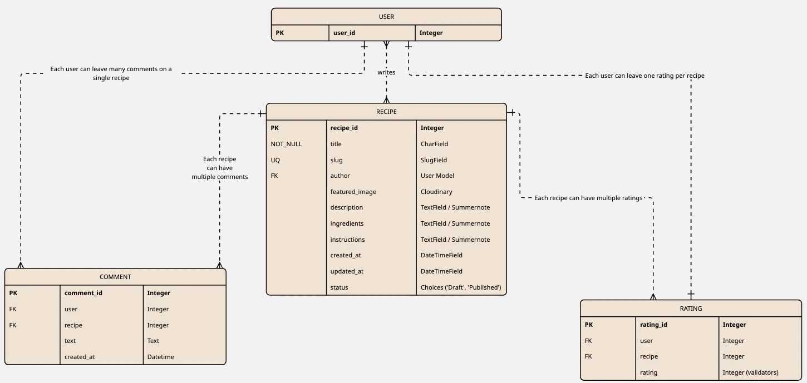
---

## Fixtures
Most of the database was populated using a fixture file in JSON format and contains:
- Pre-filled recipes with author, description, ingredients and instructions, following the fields of the Recipe model.
- All relevant fields including HTML-formatted content (I.e. ordered and unordered list tags and list items)

---

## Wireframes
Wireframes created with [miro.com](https://miro.com/).

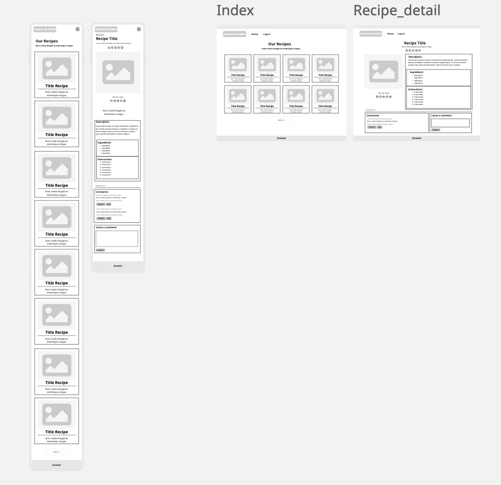

---

## Technologies Used

- Languages: HTML5, CSS3, JS, Python
- [GitHub](https://github.com/) -  Used to host the project
- [Visual Studio Code](https://code.visualstudio.com/download) - IDE connected
- [canva.com](https://canva.com/) - Used to edit the logo
- [coolors.co](https://coolors.co/) - Used to create the colour palette based on the logo
- [Font Awesome](https://fontawesome.com/) - Star icons on ratings
- [Django 5.2](https://docs.djangoproject.com/en/5.2/) - Used for responsive design and UI components.
- [Heroku](https://www.heroku.com/) - Used to deploy the project
- [Cloudinary](https://cloudinary.com/) - Used to host static images
- [Django Allauth](https://docs.allauth.org/en/latest/) - Used for user authentication and account management.
- [Bootstrap 5.3](https://getbootstrap.com/) - Used for responsive design and UI components.
- [AJAX](https://developer.mozilla.org/en-US/docs/Glossary/AJAX) - Used to enable asynchronous updates for ratings.
- [Google Fonts](https://fonts.google.com/) - Used to customize the project's fonts. 
- [cloudconvert](https://cloudconvert.com/) - to convert images' formats.
- [PE8CI](https://pep8ci.herokuapp.com/#)
- [Mockup Generator](https://websitemockupgenerator.com/)
- [prettier.io](https://prettier.io) - to beautify the js and css code
- [Google's Inspect Element](https://developer.chrome.com/docs/devtools) - to debug code and see console logs and errors
- [Chat GPT](https://chatgpt.com/) and [Claude AI](https://claude.ai/) - Used to explain concepts that were not so obvious and as a very useful aid in debugging.
- [tabletomarkdown.com](https://tabletomarkdown.com/convert-spreadsheet-to-markdown/): to easily generate my tables by importing spreadsheets.
- [Markdown TOC generator](https://bitdowntoc.derlin.ch/) - Used to automatically generate a table of contents 
- [Autoprefixer](https://autoprefixer.github.io/): to parse my CSS file and add the needed prefixes for browser compatibility.  
- [miro.com](https://miro.com/): to generate the ERD and wireframes

---

## Testing

### Validation

[Validation Folder](README-folder/validation)
- HTML validated with [W3C Validator](https://validator.w3.org/) 
Index.html:  
    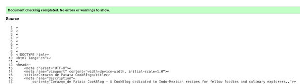  
Recipe_detail.html:  
    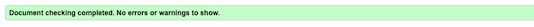  
- CSS validated with: [W3C Validator](https://validator.w3.org/) 
    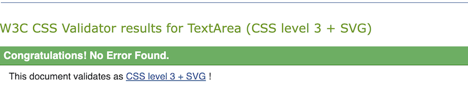
        <p>
            <a href="https://jigsaw.w3.org/css-validator/check/referer">
                
            </a>
        </p>

- JS validated with [JSHint](https://jshint.com/)  
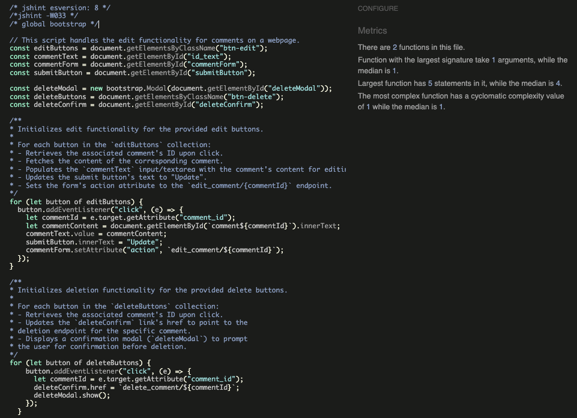  

- Python code checked with [PE8CI](https://pep8ci.herokuapp.com/#):
All python files were passed through the linter and cleaned until no errors were found. Here listed, are the ones with most code and which seemed relevant to share:  
**Admin.py**  
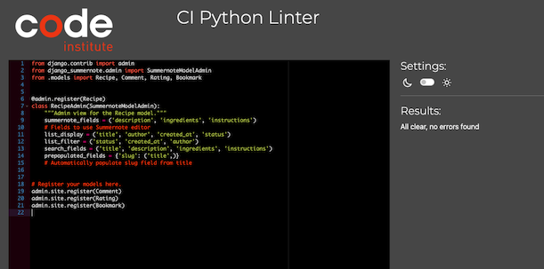 
**models.py**  
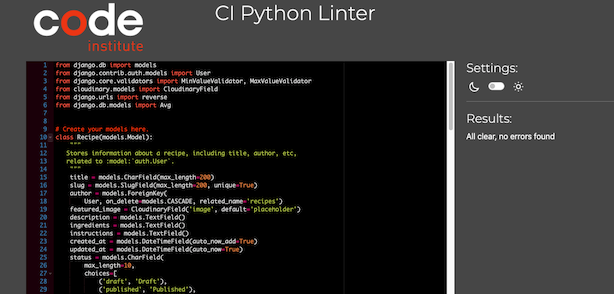  
**urls.py**  
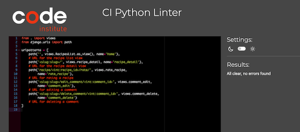  
**views.py**  
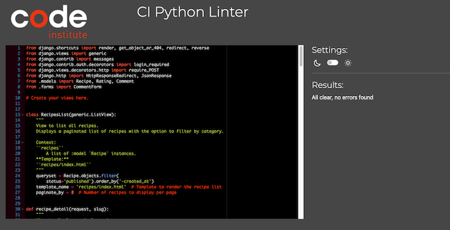  

### Manual Testing
<strong>Manual testing</strong> involves checking a project’s functionality by simulating user interactions, typically through clicking buttons, filling out forms, and testing the logic and responsiveness in different browsers and resolutions. It is an essential way to ensure that a product meets the user's expectations but comes with limitations. It can be time-consuming, resource-intensive, and prone to human error,  making it unreliable (especially for larger projects). Tiredness, biases, and/or oversight can lead to missed bugs and issues that can dampen the user’s experience. Manual testing is best deployed when we need to assess the user experience (UX), or when testing specific user stories that require human judgment to evaluate nuances, which would not be picked by automated tests. 

<strong>Automated testing</strong>, on the other hand, uses code to run tests on software, providing a faster, scalable solution for detecting errors early in the development process. Automated tests can be written to target specific scenarios and run hundreds of tests in a short amount of time, making them ideal when verifying that new code hasn't broken existing functionality. However, automated tests are only as reliable as the test cases designed to check, and they do not assess the user experience. Therefore, a combination of manual and automated testing is often the best approach, where automated testing handles repetitive tasks and error detection; manual testing focuses on areas where human insight and user experience are critical. 

This site was thoroughly tested using a <strong>manual testing</strong> approach. These tests led to catching and fixing issues from early in the development. Some friends and family also contributed towards testing the game’s logic and provided valuable feedback. 

Please see below for the tests and final results:

Tested across:
- Chrome, Safari (desktop & mobile)
- All core views tested with both authenticated and guest users

| Feature          | Test Scenario                           | Result |
|------------------|------------------------------------------|--------|
| Login Required   | Rating/commenting                        | Pass   |
| Mobile UI        | Screen sizes < 768px                     | Pass   |
| Admin Panel      | CRUD operations                          | Pass   |
| Ratings           | Ratings persist across user sessions    | Pass   |
| Form validation | Comments and ratings are sent successfully | Pass |
| Message handling | Messages are displayed to the user on Post | Pass |
| Log in buttons    | User can login from navbar, ratings and comment forms | Pass |
| Images are loaded | Recipe images are loaded on Index and Recipe_detail | Failed (Fixed) |


### Fixed Bugs

- **IntegrityError** during DB updates  
  Fix: `makemigrations` and `migrate` rerun after model adjustments  
- **Rating update** was duplicating entries  
  Fix: `get_or_create()` + `update()` logic in view  
- **AJAX errors** on unauthenticated users  
  Fix: Client-side check for auth before submitting via JS  
- **404 not styled**  
  Fix: Custom templates following [LearnDjango's tutorial](https://learndjango.com/tutorials/customizing-django-404-and-500-error-pages)
- **Placeholder image not loading on recipe_detail.html**
  Fix: Wrong model being referenced on if statement. Changed to recipe.featured_image

---

## Deployment
<strong>Create a GitHub Repository</strong>  
	1. Go to [GitHub website](https://github.com/) and navigate to the <strong>Settings</strong> tab.  
	2. [Create a new public repository](https://github.com/new) using the format username.github.io, where username is your GitHub username.    
	3. Optionally, add a repository description, select whether it will be public or private, and initialise it with a README file (optional).  
	4. <strong>Forking:</strong> If deploying a project you don’t own, fork the repository first by clicking the "Fork" button at the top right of the project repository.  
	5. Configure GitHub Pages later in the settings.  
2. <strong>Clone and Deploy a Project</strong>  
	1. (Optional) Install [GitHub Desktop](https://desktop.github.com/) if you prefer a graphical interface for managing repositories.  
	2. Clone the repository:  
		* After installing GitHub Desktop (if you're using it), refresh the page on GitHub and click the “Set up in Desktop” button.  
		* The GitHub Desktop app will open. Select a location to save the project and clone it.  
	3. Create an <strong>index.html</strong> file for your project if it doesn’t already exist.  
	4. Use the terminal to:  
		* <strong>Add</strong> your changes: git add .  
		* <strong>Commit</strong> your changes: git commit -m "Initial commit"  
		* <strong>Push</strong> your changes: git push origin main  
3. <strong>Clone and Deploy This Project</strong>  
	1. Go to my GitHub repository for this project: [Corazon de Patata](https://github.com/osoriomica/corazon_de_patata).  
	2. In the top right corner of the repository page, click the green Gitpod icon to open a new workspace in Gitpod.
	3. You can choose to work locally or download the project and edit it in an IDE like [Visual Studio Code](https://code.visualstudio.com/download).

### Deploy to [Heroku](https://www.heroku.com/) using the following steps:

1. Create `Procfile`, `requirements.txt`, `runtime.txt`
2. Set allowed hosts and static file settings in `settings.py`
3. Set up Cloudinary and environment variables
4. Push to GitHub → connect to Heroku via GitHub integration
5. Enable automatic deploys and run `heroku run python manage.py migrate`

---

## Running the Project Locally  

To run this project locally, follow the steps below:  

### 1. Clone the repository  
>```bash  
>git clone https://github.com/yourusername/corazon-de-patata.git  
>cd corazon-de-patata  
### 2. Create and activate a virtual environment  
>python3 -m venv venv  
>source venv/bin/activate  # On Windows: venv\Scripts\activate  
### 3. Install project dependencies  
>pip install -r requirements.txt  
### 4. Set environment variables  
Create a .env file in the root directory and include:  
>SECRET_KEY=your-django-secret-key  
>DEBUG=True  
>DATABASE_URL=sqlite:///db.sqlite3  
>CLOUDINARY_URL=your-cloudinary-url  
>ALLOWED_HOSTS=127.0.0.1,localhost  
### 5. Apply migrations and load fixtures  
>python manage.py migrate  
>python manage.py loaddata recipes.json  
### 6. Run the development server  
>python manage.py runserver    
Visit http://127.0.0.1:8000 in your browser.  

---

## Credits

### Code

- [DjangoDocs](https://docs.djangoproject.com/)
- Custom error handling via [LearnDjango](https://learndjango.com/)
- [Bootstrap documentation](https://getbootstrap.com/docs/5.3/getting-started/introduction/) for general reference in layout styling, navigation bars and modals, etc.
- Star Rating inspired by [James Barnett's CSS Star Rating](https://codepen.io/jamesbarnett/pen/najzYK)

### Media

- AI-generated food images and site's logo from [MicrosoftCopilot](https://copilot.microsoft.com/)
- Icons from [Font Awesome](https://fontawesome.com/)
- Fonts from [GoogleFonts](https://fonts.google.com/)
- Images converted via [cloudconvert](https://cloudconvert.com/png-to-ico)

### Acknowledgements

Thanks to my mentor and my teacher for their patience and guidance in this journey.

---

 *Cook with love. Code with spice.*
